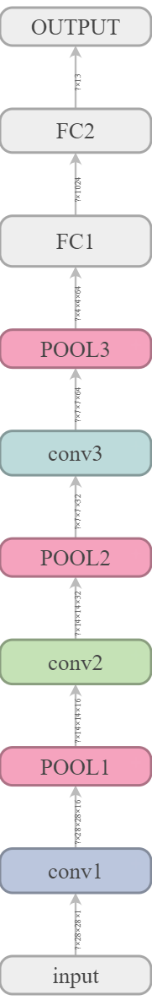

使用CNN 实现小型Google你画电脑猜

## 你画电脑猜 

Google 的猜画小歌风靡一时，使用 CNN 我们也可以搞一个出来。

### 数据集

Google AI Lab 已经开源了用来训练的数据集：https://github.com/googlecreativelab/quickdraw-dataset
里边有 354 类共5千万张涂鸦图片，并提供多种格式，从原始的笔迹数据到转换好的位图都有。我们将使用其中的 numpy 格式版本。

如果能够访问 Google Drive 的话，可以从 https://console.cloud.google.com/storage/quickdraw_dataset/full/numpy_bitmap 下载或者有装过 gsutil 的话，可以 ```gsutil -m rsync gs://quickdraw_dataset/full/numpy_bitmap/ .```

由于这个真实项目的数据集规模相当大，有文件小很多的矢量格式可以下载，比如 binary 里就是一种。另外 https://console.cloud.google.com/storage/browser/quickdraw_dataset/sketchrnn 这里提供了一个npz格式的子集，只包含7万5千张图片，numpy.load() 既能加载 .npy 也能加载 .npz 倒是方便。不过所有的矢量格式，下载回来都要预处理转成位图，不然没法喂给咱们的 CNN 网络。这两个文件格式可以参考 binaryparser.ipbn

### 模型

Google AI Lab 在 https://arxiv.org/abs/1704.03477 这篇论文里解释了他们是怎么干的，并且在 github 上提供了实现，那是一个相对复杂的 RNN 模型。这里我们用一个较为简单的 CNN 模型来解决这个问题。


模型结构：



代码实现：

```python
# 搭建模型结构
# 重置图，可以反复运行，
tf.reset_default_graph()

# 所需变量
x = None
y = None
# 三层卷积，三层池化，三层激活层，两层全连接层
# 权重,
w_conv = [None, None, None]
# 偏差值
b_conv = [None, None, None]
# 卷积
r_conv = [None, None, None]
# 激活
h_conv = [None, None, None]
# 池化层
h_pool = [None, None, None]
keep_prob = None
# 全连接层
w_fc = [None, None]
b_fc = [None, None]
h_fc = [None, None]

def build_model():
    global x, y
    global w_conv, b_conv, r_conv, h_conv
    global h_pool, keep_prob
    global w_fc, b_fc, h_fc
    
    # 输入层 
    with tf.variable_scope('input'):
        x = tf.placeholder(tf.float32
                                 , shape=[None, 28, 28, 1]
                                 , name = 'x')
        
    # 卷积层 1： conv1 [None, 28, 28, 16]
    with tf.variable_scope('conv1'):
        # truncated_normal 从截断的正态分布中输出随机值
        w_conv[0] = tf.Variable(tf.truncated_normal([3, 3, 1, 16]
                                , stddev = 0.1))
        b_conv[0] = tf.Variable(tf.truncated_normal([16]
                                , stddev = 0.1))
        r_conv[0] = tf.nn.conv2d(x, w_conv[0], strides=[1,1,1,1]
                                , padding="SAME")
        # wx + b
        r_conv[0] = r_conv[0] + b_conv[0]
        
    # 激活层 1： h1
    with tf.variable_scope('h1'):
        h_conv[0] = tf.nn.relu(r_conv[0])
        
    # 池化层 1： pool1 [None, 14, 14, 16]
    with tf.variable_scope('pool1'):
        h_pool[0] = tf.nn.max_pool(h_conv[0], ksize = [1,2,2,1]
                                  , strides = [1,2,2,1], padding = 'SAME')
    
    
    # 卷积层 2： conv2 
    with tf.variable_scope('conv2'):
        w_conv[1] = tf.Variable(tf.truncated_normal([3, 3, 16, 32]
                                , stddev = 0.1))
        b_conv[1] = tf.Variable(tf.truncated_normal([32]
                                , stddev = 0.1))
        r_conv[1] = tf.nn.conv2d(h_pool[0], w_conv[1], strides=[1,1,1,1]
                                , padding = 'SAME')
        r_conv[1] = r_conv[1] + b_conv[1]
    
    # 激活层 2： h2
    with tf.variable_scope('h2'):
        h_conv[1] = tf.nn.relu(r_conv[1])
    
    # 池化层 2:  pool2 [None, 7, 7, 32]
    with tf.variable_scope('pool2'):
        h_pool[1] = tf.nn.max_pool(h_conv[1], ksize=[1,2,2,1]
                                  , strides = [1,2,2,1], padding='SAME')
    
    # 卷积层 3： conv3
    with tf.variable_scope('conv3'):
        w_conv[2] = tf.Variable(tf.truncated_normal([3, 3, 32, 64]
                                , stddev = 0.1))
        b_conv[2] = tf.Variable(tf.truncated_normal([64]
                                , stddev = 0.1))
        r_conv[2] = tf.nn.conv2d(h_pool[1], w_conv[2], strides=[1,1,1,1]
                         , padding = 'SAME')
        r_conv[2] = r_conv[2] + b_conv[2]
        
        
    # 激活层 3： h3
    with tf.variable_scope('h3'):
        h_conv[2] = tf.nn.relu(r_conv[2])
        
    # 池化层 3： pool3 [None, 4, 4, 64]
    with tf.variable_scope('pool3'):
        h_pool[2] = tf.nn.max_pool(h_conv[2], ksize=[1,2,2,1]
                                  , strides = [1,2,2,1], padding='SAME')
        
    # 全连接层 1 ： fc1
    with tf.variable_scope('fc1'):
        keep_prob = tf.placeholder(tf.float32)
        h_pool3_flat = tf.reshape(h_pool[2], [-1, 4*4*64])
        w_fc[0] = tf.Variable(tf.truncated_normal([4*4*64, 1024]
                                , stddev = 0.1))
        b_fc[0] = tf.Variable(tf.truncated_normal([1024]
                                , stddev = 0.1))
        h_fc[0] = tf.nn.relu(tf.matmul(h_pool3_flat, w_fc[0]))
        h_fc[0] = h_fc[0] + b_fc[0]
        # 正则化
        h_fc[0] = tf.nn.dropout(h_fc[0], keep_prob)
        
    # 全连接层 2 :  fc2
    with tf.variable_scope('fc2'):
        # 分类 count 12种
        w_fc[1] = tf.Variable(tf.truncated_normal([1024, count]
                                , stddev = 0.1))
        b_fc[1] = tf.Variable(tf.truncated_normal([count]
                                , stddev = 0.1))
        h_fc[1] = tf.matmul(h_fc[0], w_fc[1])
        h_fc[1] = h_fc[1] + b_fc[1]
    
    # output,多分类softmax函数
    with tf.variable_scope('output'):
        prediction = tf.nn.softmax(h_fc[1])
    
    return prediction
```


具体源代码在 QuickDraw.ipynb